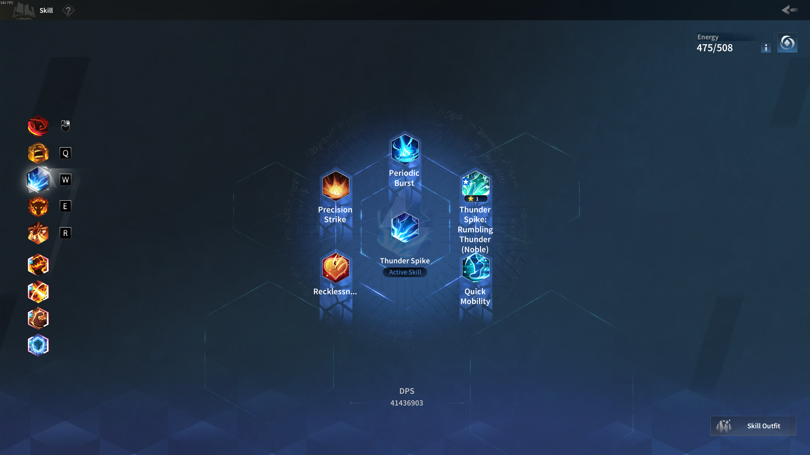

# Import Skills Guide

Import your in-game skills into the build planner using AI-assisted screenshot parsing.

## Steps

### 1. Take in-game screenshots

Open your skill page in Torchlight Infinite. For each active and passive skill, navigate to its detail view showing the main skill and its support skills. Take a screenshot of each skill slot. Ensure that the screenshot is a full-screen screenshot.



### 2. Upload screenshots to an AI chatbot

Upload your screenshots to [Claude](https://claude.ai) or [ChatGPT](https://chatgpt.com) with the following prompt:

````text
I've attached in-game screenshots of a player's skill page from the game Torchlight Infinite.
For each screenshot, I want you to give me:
* Slot: which can be determined by which icon is highlighted on the left, which should also look similar to the current page's center skill icon
  * Active skills have slots 1-5, passive have 1-4
* Skill Name: the center skill's name
* Support Skill Name 1-5:
  * For Active Skills (you can see it say "Active Skill"), the support skill order starts at the top and goes counter-clockwise (top, top-left, bottom-left, bottom-right, top-right)
  * For Passive Skills (you can see it say "Passive Skill"), the support skill order starts on the left and goes clockwise (left, top-left, top, top-right, right)
  * If it says "Energy Available" or "Locked", there's no support skill present and you should skip it
  * If there are ellipses, do not try to guess what the full name is. output the name as shown
Use the following structure: `{skillType: "active" | "passive", slot: number, name: string, supports: [{slot: number, name: string}]}
Example:
```
[
  {
    "skillType": "active",
    "slot": 1
    "name": "Blazing Bullet",
    "supports": [
      { "slot": 1, "name": "Critical Strike Damage Increase"}
    ]
  }
]
```
````

### 3. Import into the build planner

1. Go to the **Skills** tab
2. Click the **Import Skills** button
3. Paste the JSON output from the AI chatbot
4. Click **Import**

Your skills and their support skills will be populated in the corresponding slots. Any skill names that couldn't be matched will show as warnings.
